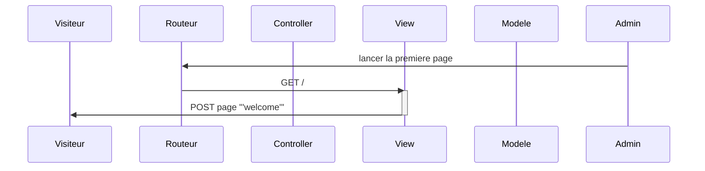
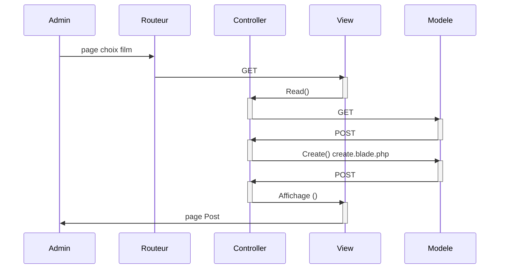
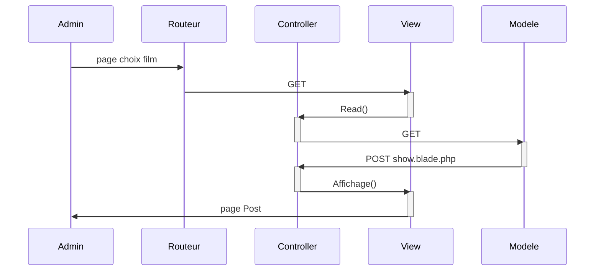
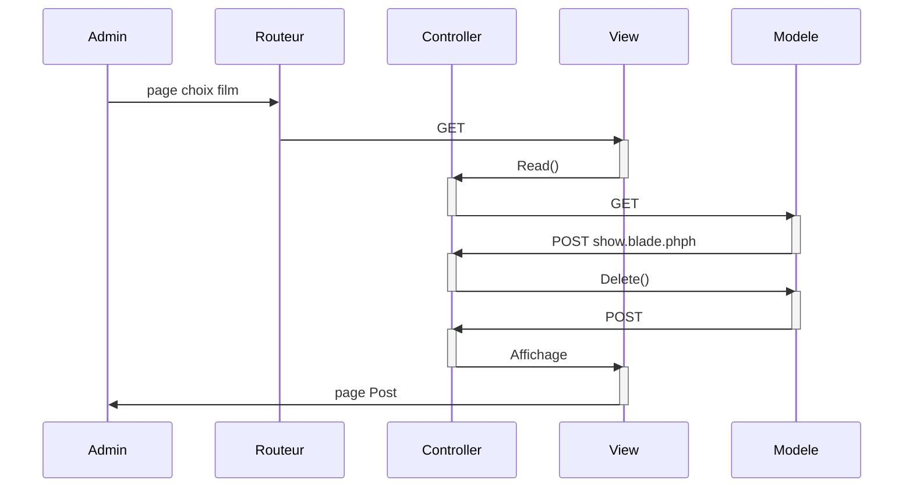
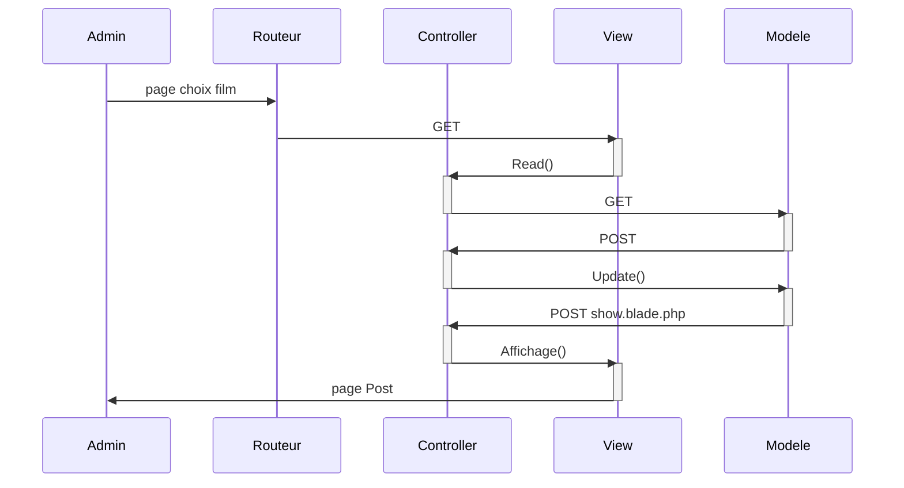

# CineActus

Site permettant de gerer les actualités Cinematographiques.
Une application utilisant CRUD Laravel 8.

# Lancement du site

http://techer-gregory.sprint-07.sc1lgvu9627.universe.wf/

## License

The Laravel framework is open-sourced software licensed under the [MIT license](https://opensource.org/licenses/MIT).

# Maquette

Cliquez sur ce lien pour visionner la maquette du site: https://www.figma.com/file/cTg7mze09exD3amUzwyvmL/maquette-Laravel

# Lien

https://www.gekkode.com/developpement/tutoriel-laravel-8-3-la-structure-mvc/

## UML Sequence page d'accueil

## UML Sequence Creation d'un post

L'utilisateur (Admin) est sur la page d'accueil

## UML Sequence Read post

L'utilisateur (Admin) est sur la page d'accueil

## UML Sequence Delete post

L'utilisateur (Admin) est sur la page d'accueil

## UML Sequence Update post

L'utilisateur (Admin) est sur la page d'accueil

